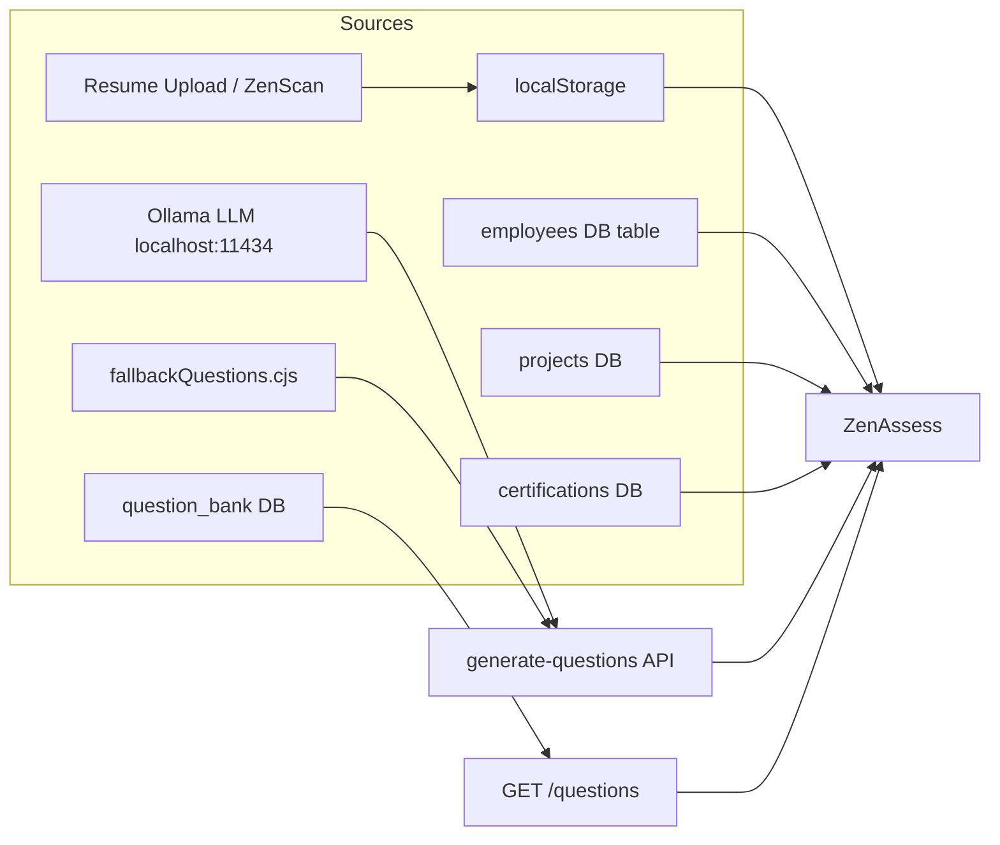
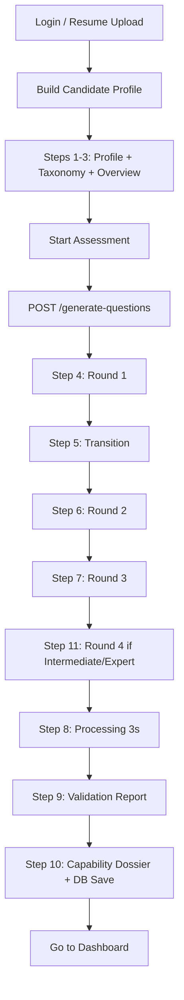
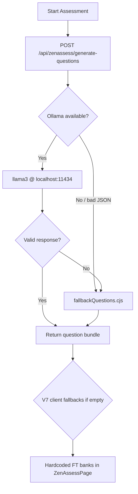
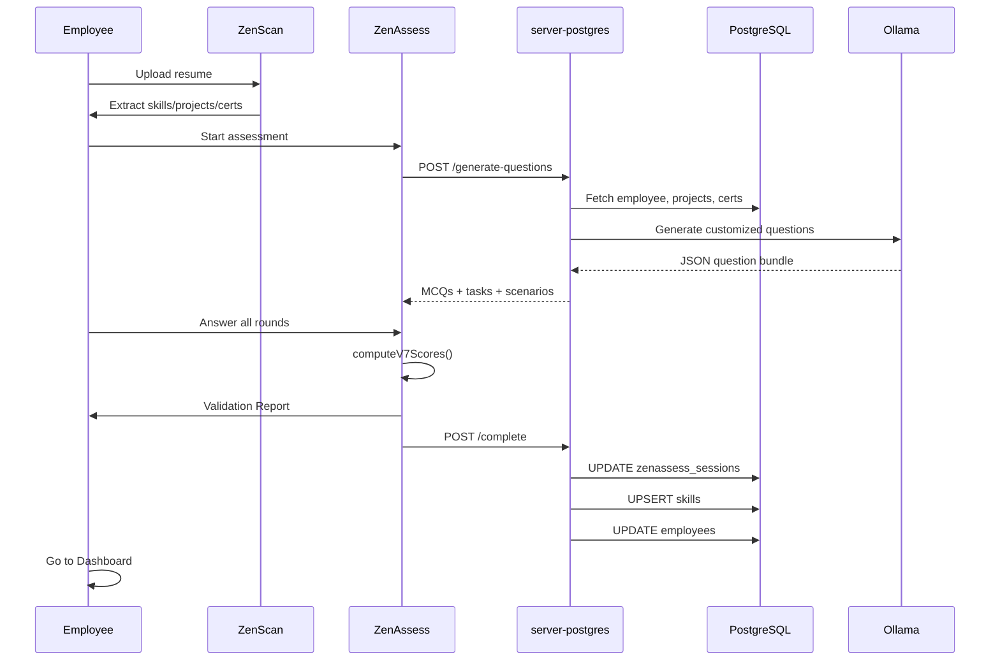
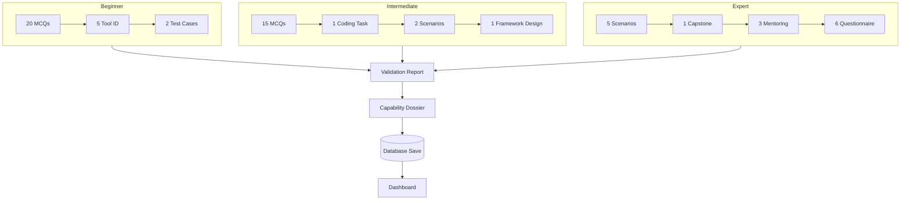

# ZenAssess — Complete Deep Analysis

> **Product name:** ZenAssess (AI-powered skill validation in ZenSkill Navigator)  
> **Routes:** `/employee/assessment-overview` · `/employee/zenassess`  
> **Last analyzed:** June 7, 2026  
> **Codebase:** `zenlap` repository

This document is a full end-to-end analysis of how ZenAssess works: where data comes from, how assessments run, how questions are generated and validated, what each level shows, what is stored in the database, and what happens on the dashboard after completion.

---

## Table of Contents

1. [Executive Summary](#1-executive-summary)
2. [What ZenAssess Does](#2-what-zenassess-does)
3. [Where Data Comes From](#3-where-data-comes-from)
4. [Entry Points & User Journey](#4-entry-points--user-journey)
5. [Assessment Paths: Beginner, Intermediate, Expert](#5-assessment-paths-beginner-intermediate-expert)
6. [V7 Flow (Primary — Default UI)](#6-v7-flow-primary--default-ui)
7. [Legacy Flow (Beta Toggle)](#7-legacy-flow-beta-toggle)
8. [Rounds & Question Counts by Level](#8-rounds--question-counts-by-level)
9. [Question Generation Pipeline](#9-question-generation-pipeline)
10. [Validation, Scoring & Integrity](#10-validation-scoring--integrity)
11. [Validation Report & Final Dossier](#11-validation-report--final-dossier)
12. [After Completion: Dashboard & ZenMatrix](#12-after-completion-dashboard--zenmatrix)
13. [Database: What Gets Stored](#13-database-what-gets-stored)
14. [Backend API Reference](#14-backend-api-reference)
15. [Roles & Permissions Split](#15-roles--permissions-split)
16. [Architecture Diagrams](#16-architecture-diagrams)
17. [Known Gaps & Inconsistencies](#17-known-gaps--inconsistencies)

---

## 1. Executive Summary

ZenAssess validates employee skills **before** they are permanently saved to the skill matrix. It sits between **ZenScan** (resume upload / extraction) and **ZenMatrix** (skill profile dashboard).

| Aspect | Summary |
|--------|---------|
| **Purpose** | Validate primary/secondary/tertiary skills with timed, multi-round assessments |
| **Paths** | **Beginner** (60% pass), **Intermediate** (65%), **Expert** (70%) |
| **Default UI** | V7 Candidate Journey — 10+ steps, multi-round wizard |
| **Alternate UI** | Legacy beta — 4 bands (beginner/intermediate/advanced/expert) |
| **Question source** | Ollama LLM → `fallbackQuestions.cjs` → hardcoded client banks → `question_bank` DB |
| **Persistence** | `zenassess_sessions`, `skills`, `employees`, `manager_reviews`, `zenassess_evidence` |
| **Post-completion** | User clicks **Go to Dashboard** → `/employee/dashboard` (not automatic) |

**Important:** There is **no separate "Diagnostic" assessment path** in code. "Diagnostic" appears only inside some MCQ question text, not as a user-facing mode.

---

## 2. What ZenAssess Does

ZenAssess answers three business questions:

1. **Is this employee's claimed skill level real?** — MCQs, practical tasks, scenarios, and (for experts) evidence + discussion.
2. **What validated level should be stored?** — Beginner, Intermediate, Expert, or Not Validated.
3. **What should they study or do next?** — ZenAICoach tips, study paths (on fail), allocation readiness scores.

### Core principle (from requirements)

> Skills are **NOT** saved to the backend skill matrix until ZenAssess validation completes successfully.

Resume upload saves education, certifications, projects, and achievements — but **not** final skill ratings.

---

## 3. Where Data Comes From

### 3.1 Input Data Sources



| Source | Key / Location | Data Provided |
|--------|----------------|---------------|
| **ZenScan / Resume Upload** | Route state `extractedData`, `localStorage.zenscan_raw_extraction` | Name, years IT, skills, projects, certs, education |
| **Candidate Profile** | `localStorage.candidateProfile` | Primary/secondary/tertiary skills, path, grade, job family |
| **Zen Taxonomy Engine** | `src/lib/zenTaxonomy.ts` | 32 canonical skills, top-3 ranking, confidence scores |
| **Employee record** | `GET /api/employees/:id` | Grade, designation, years IT, GitHub username |
| **Projects** | `projects` table | Project names, roles, domains, technologies |
| **Certifications** | `certifications` table | Cert names, issuers, dates |
| **Question bank** | `question_bank` table | Pre-seeded MCQs by skill + band |
| **Ollama** | `http://127.0.0.1:11434/api/generate` (model: `llama3`) | Profile-customized questions |
| **Fallback bank** | `fallbackQuestions.cjs` | 9 skill domains × 3 bands |

### 3.2 localStorage Keys Used

| Key | Purpose |
|-----|---------|
| `zenscan_raw_extraction` | Raw resume extraction JSON |
| `candidateProfile` | Computed profile with path and top-3 skills |
| `grade_mapping` | Grade → path mapping (F1→Beginner, etc.) |
| `override_enabled_{employeeId}` | Admin/test path override flag |
| `override_path_{employeeId}` | Forced Beginner/Intermediate/Expert path |
| `zn_access_token` | JWT for API auth |

### 3.3 Zen Taxonomy — 32 Canonical Skills

From `zenTaxonomy.ts`, skills are grouped as:

- **Tools:** Selenium, Appium, JMeter, Postman, JIRA, TestRail
- **Technologies:** Python, Java, JavaScript, TypeScript, C#, SQL
- **Application Testing:** API, Mobile, Performance, Security, Database Testing
- **Domain:** Banking, Healthcare, E-Commerce, Insurance, Telecom
- **Testing Types:** Functional, Automation, Regression, UAT
- **DevOps:** Git, Jenkins, Docker, Azure DevOps
- **AI:** ChatGPT/Prompt Engineering, AI Test Automation

**Scoring weights for taxonomy ranking:**

| Factor | Weight |
|--------|--------|
| Projects | 40% |
| Experience (years IT) | 30% |
| Certifications | 15% |
| Keywords from resume | 15% |

Output: **Primary**, **Secondary**, **Tertiary** skill with confidence % and recommended roles/projects.

---

## 4. Entry Points & User Journey

### 4.1 How Users Reach ZenAssess

| Entry | Route | Behavior |
|-------|-------|----------|
| **Resume upload** | `/employee/resume-upload` → `/employee/zenassess` | Primary onboarding flow; passes `extractedData` in route state |
| **App header** | Direct link to `/employee/zenassess` | Can start without overview page |
| **Assessment overview** | `/employee/assessment-overview` → `/employee/zenassess` | Optional pre-gate; saves candidate profile to DB |
| **Login redirect** | Unauthenticated users → `/login` | Protected routes |

### 4.2 Full Journey (V7 — Default)



### 4.3 Assessment Overview Page (Optional Pre-Gate)

**File:** `src/pages/AssessmentOverviewPage.tsx`

**Shows:**

- Grade (F1–C), Job Family, Years of Experience
- Validation Path badge (Beginner / Intermediate / Expert)
- Top 3 skills: Primary, Secondary, Tertiary
- Assessment format card (rounds, duration, pass mark)

**On "Start Assessment":**

1. `GET /api/zenassess/can-retake/:employeeId?path=...` — cooldown check
2. `POST /api/employees/:employeeId/candidate-profile` — saves profile to DB
3. `navigate('/employee/zenassess', { state: { candidateProfile, fromOverview: true } })`
4. Saves `candidateProfile` to `localStorage`

---

## 5. Assessment Paths: Beginner, Intermediate, Expert

### 5.1 Path Assignment Logic

Two assignment systems exist (can diverge):

#### A. Grade-based (Assessment Overview)

| Grade | Path |
|-------|------|
| F1 | Beginner |
| F2, E1, E2 | Intermediate |
| D, C | Expert |

Override via `localStorage` keys per employee ID.

#### B. Years-based (V7 mount logic)

| Years IT | Path |
|----------|------|
| 0–5 | Beginner |
| 6–11 | Intermediate |
| 12+ | Expert |

#### C. Legacy band detection (`detectBand`)

**Functional Testing skill:**

| Years | Band |
|-------|------|
| 0–5 | beginner |
| 6–11 | intermediate |
| 12+ | expert |

**All other skills:**

| Years | Band |
|-------|------|
| 0–1 | beginner |
| 2–4 | intermediate |
| 5–7 | advanced |
| 8+ | expert |

### 5.2 Pass Thresholds (V10)

| Path | Pass % | On Fail (Backend) |
|------|--------|-------------------|
| **Beginner** | 60% | `failed`, `Not Validated`, retry in **7 days** |
| **Intermediate** | 65% | **Silent tier drop** → assigned Beginner, still `passed` |
| **Expert** | 70% | **Silent tier drop** → assigned Intermediate, still `passed` |

> **Silent tier drop:** If an Expert scores below 70%, they are marked `passed` but validated at Intermediate. Same for Intermediate → Beginner. Only Beginner path can truly fail.

### 5.3 Timers

| Path | Duration |
|------|----------|
| Beginner | 30 minutes (1800 seconds) |
| Intermediate | 60 minutes (3600 seconds) |
| Expert | 60 minutes (3600 seconds) |

Timer auto-submits assessment when it reaches zero.

---

## 6. V7 Flow (Primary — Default UI)

**File:** `src/pages/ZenAssessPage.tsx`  
**Flag:** `v7FlowActive = true` (default)

### 6.1 Step-by-Step Breakdown

| Step | Name | What User Sees |
|------|------|----------------|
| **1–3** | Pre-Assessment | Combined page: ZenScan profile summary, 32-skill taxonomy radar/list, assessment overview with path-specific round list |
| **4** | Round 1 | Beginner/Intermediate: MCQ test. Expert: 5 complex scenario questions (free text) |
| **5** | Transition | "Round 1 Completed" interstitial |
| **6** | Round 2 | Beginner: Tool Identification (5). Intermediate: Coding task (1). Expert: Capstone (GitHub URL + description) |
| **7** | Round 3 | Beginner: Test case writing (2 tasks). Intermediate: Scenarios (2). Expert: Mentoring evidence (3 text areas) |
| **11** | Round 4 | Intermediate: Framework design (1). Expert: Experience questionnaire (6 questions) |
| **8** | Processing | 3-second spinner: "Assessment Submitted Successfully" |
| **9** | Validation Report | Scores, pass/fail, validated tier, ZenAICoach tips |
| **10** | Capability Dossier | Skill impact table, recommended roles/projects, auto DB save, **Go to Dashboard** button |

### 6.2 What ZenAssess Shows During Assessment

**Profile section (Steps 1–3):**

- Employee name, designation, years IT
- Primary / Secondary / Tertiary skill with confidence %
- Full 32-skill taxonomy breakdown
- Path badge and round summary
- Countdown timer (starts when assessment begins)

**During rounds:**

- Question text with options (MCQ) or textarea (scenarios/practical)
- Progress indicator across steps 4–7/11
- MCQ negative marking notice (−0.5 per wrong answer)
- Section completion before advancing

**Proctoring (tracked client-side, sent on complete):**

- Tab switches
- Copy/paste events
- Fullscreen exits
- Browser blur/focus loss
- DevTools detection
- Typing velocity log
- Answer snapshots

---

## 7. Legacy Flow (Beta Toggle)

Toggle **"Legacy View"** in ZenAssessPage to switch to the original beta implementation.

### 7.1 Sections

| Section | Content |
|---------|---------|
| **profile** | Skill review, band detection, start button |
| **test** | MCQ / evidence / multi-part Functional Testing |
| **results** | Score breakdown, study path, dashboard buttons |

### 7.2 Legacy Tabs (within profile section)

- **Assess** — main test flow
- **History** — past sessions via `GET /zenassess/history/:id`
- **Analytics** — averages via `GET /zenassess/analytics/:id`
- **Learning Paths** — recommendations via `GET /zenassess/recommendations/:id`

### 7.3 Legacy Band Behaviors

| Band | Flow |
|------|------|
| **Beginner** | 10 MCQs, 45-min timer, topic pagination |
| **Intermediate** | 10 MCQs → contribution scan (GitHub/CI URLs) **OR** Functional Testing 3-part (MCQ + practical + scenarios with **AI evaluation**) |
| **Advanced** (5–8 yrs) | 10 hard MCQs only; pass ≥ 70% → Advanced level |
| **Expert** (8+ yrs) | Evidence upload (up to 10 files) → 4 adaptive AI discussion questions → manager review queue |

### 7.4 Legacy Expert Sub-Flow (Most AI-Heavy)

**Steps:** profile → evidence_form → evidence_result → adaptive_discussion → finalizing

1. `generateExpertProfileAI()` — builds expert profile from resume
2. Universal evidence upload — PDF, DOCX, PPTX, XLSX, TXT, images
3. `classifyDocumentAI()` + `evaluateUniversalEvidenceAI()`
4. **4 adaptive questions:** Technical → Technical → Leadership → Architecture/Ownership
5. Consistency, risk, authenticity analysis
6. `POST /zenassess/complete` with `status: review_required`

### 7.5 Special Case: Functional Testing 12+ Years

If skill = Functional Testing AND years ≥ 12 AND band = expert:

- **Automatic Expert Recognition** — no test taken
- Score = 100, status = passed, level = Expert
- Employee record updated: `years_it ≥ 12`, designation = "Functional Testing Expert"
- Audit log: `AUTOMATIC_EXPERT_RECOGNITION`

---

## 8. Rounds & Question Counts by Level

### 8.1 V7 Path Summary

#### Beginner — 4 Rounds, ~27 Items

| Round | Step | Count | Type | Content |
|-------|------|-------|------|---------|
| 1 | 4 | **20 MCQs** | Multiple choice | Server-generated or hardcoded Functional Testing bank |
| 2 | 6 | **5 questions** | Tool Identification | Selenium, Postman, JIRA, JMeter, defect lifecycle |
| 3 | 7 | **2 tasks** | Test case writing | Login page scenario, payment form scenario |
| — | — | — | — | **Total interactive items: ~27** |

**Score weights:** MCQ 50% + Tool ID 20% + Test Case Writing 30%

#### Intermediate — 4 Rounds, ~19 Items

| Round | Step | Count | Type | Content |
|-------|------|-------|------|---------|
| 1 | 4 | **15 MCQs** | Multiple choice | Advanced MCQs from server or fallback |
| 2 | 6 | **1 task** | Coding | Skill-adaptive (API test / perf script / Selenium fix) |
| 3 | 7 | **2 scenarios** | Free text | Server scenarios or 2 hardcoded fallbacks |
| 4 | 11 | **1 task** | Framework design | Banking test framework architecture prompt |

**Score weights:** MCQ 20% + Coding 35% + Scenarios 30% + Framework 15%

#### Expert — 4 Rounds, ~15 Items

| Round | Step | Count | Type | Content |
|-------|------|-------|------|---------|
| 1 | 4 | **5 scenarios** | Strategic free text | Performance crisis, flaky suite, multi-client, AI governance, mentoring |
| 2 | 6 | **1 capstone** | GitHub + description | Framework/strategy submission |
| 3 | 7 | **3 prompts** | Mentoring evidence | Coaching juniors, severity disputes, team development |
| 4 | 11 | **6 questions** | Experience questionnaire | Automation breadth/depth, leadership, architecture |

**Score weights:** Scenarios 25% + Capstone 40% + Mentoring 20% + Questionnaire 15%

### 8.2 Server V10 Question Targets (generate-questions)

When Ollama or fallback generates questions, the server enforces:

| Band | MCQs | Distribution across 3 skills | Practical | Scenarios | Expert extras |
|------|------|------------------------------|-----------|-----------|---------------|
| Beginner | 20 | 8 + 7 + 5 | 2 test-case tasks | 2 | — |
| Intermediate | 20 | 10 + 6 + 4 | 2 coding tasks | 3 | — |
| Expert | — | — | — | 5 scenarios | 1 capstone + 2 mentoring |

### 8.3 Legacy Question Counts

| Band | MCQs | Additional |
|------|------|------------|
| Beginner | 10 | — |
| Intermediate | 10 | + contribution OR FT 3-part |
| Advanced | 10 | — |
| Expert | 0 MCQs | Evidence + 4 adaptive AI questions |
| Performance Testing beta | 10 | From pool of 50 hardcoded questions |

### 8.4 Fallback Question Domains (`fallbackQuestions.cjs`)

9 domains, each with MCQs, practical tasks, scenarios, expert capstone, and mentoring:

1. Functional Testing
2. Automation Testing
3. Performance Testing
4. Python
5. DevOps
6. Cloud
7. Cybersecurity
8. Data Engineering
9. AI/ML

Skill names are normalized via keyword matching (e.g., "selenium" → Automation Testing).

---

## 9. Question Generation Pipeline

### 9.1 Generation Priority Chain



### 9.2 Ollama Prompt Context

The server builds a candidate summary from:

- Employee name, designation, department, years IT, primary domain
- All projects (name, role, domain, skills, technologies)
- All certifications
- Resume text (if stored on employee record)

Prompts differ by band:

- **Beginner/Intermediate:** MCQs + practical tasks + scenarios
- **Expert:** 5 scenarios + 1 capstone + 2 mentoring questions

Timeout: **45 seconds**. Response format: JSON.

### 9.3 Client-Side Fallbacks (V7)

If server returns empty or fails:

- `FUNCTIONAL_TESTING_BEGINNER_QUESTIONS` — 20 hardcoded MCQs
- `FUNCTIONAL_TESTING_INTERMEDIATE_QUESTIONS` — 15 hardcoded MCQs
- Tool ID, test cases, expert scenarios, mentoring, questionnaire — all hardcoded in `ZenAssessPage.tsx`

### 9.4 Legacy DB Questions

`GET /api/zenassess/questions?skill=X&band=Y`

Pulls from `question_bank` table with band filters:

| Request band | DB bands included |
|--------------|-------------------|
| beginner | beginner only |
| intermediate | beginner + intermediate |
| advanced | intermediate + advanced |
| expert | advanced + expert |

Functional Testing limits: 20 (beginner), 15 (intermediate), else 10.

### 9.5 How Questions Are Displayed

| Type | UI Component | Interaction |
|------|--------------|-------------|
| MCQ | Inline radio options in ZenAssessPage | Single select, immediate highlight |
| Scenario | Textarea (multi-paragraph) | Free-text answer |
| Practical/Coding | Textarea or code block | Free-text submission |
| Tool ID | Multiple choice or short answer | Per-question |
| Expert Capstone | GitHub URL + description fields | URL validation attempted (API missing — see gaps) |
| Evidence upload | File picker (legacy expert) | Up to 10 files, AI classification |

**Note:** Standalone components `QuestionCard.tsx`, `ScenarioCard.tsx`, `ProgressBar.tsx`, and `ExpertDiscussionWorkspace.tsx` exist but are **NOT wired** into the main V7 flow.

---

## 10. Validation, Scoring & Integrity

### 10.1 MCQ Scoring (V7)

```
correct = count of right answers
wrong = count of wrong answers
mcqRaw = max(0, correct - wrong × 0.5)    // negative marking
mcqPct = round((mcqRaw / total) × 100)
```

### 10.2 Section Scoring (V7 — Mostly Heuristic)

Non-MCQ sections in V7 use **word-count and keyword heuristics**, not LLM evaluation:

| Section | Heuristic approach |
|---------|-------------------|
| Tool ID | Presence of correct tool names / concepts |
| Test case writing | Word count thresholds, structure keywords |
| Coding | Length, code-like patterns, keyword presence |
| Scenarios | Word count, domain keywords |
| Framework design | Architecture terms, component mentions |
| Capstone | GitHub URL present + description length |
| Mentoring | Response length per prompt |
| Questionnaire | All 6 fields filled with minimum length |

Legacy Functional Testing intermediate path uses **AI evaluation** via `expertPathAI.ts` (`evaluatePracticalTaskAI`, `evaluateScenarioResponseAI`).

### 10.3 Weighted Final Score Formulas

#### V7 Frontend (client)

| Path | Formula |
|------|---------|
| Beginner | `mcq×0.50 + toolId×0.20 + testCaseWriting×0.30` |
| Intermediate | `mcq×0.20 + coding×0.35 + scenarios×0.30 + frameworkDesign×0.15` |
| Expert | `expertScenarios×0.25 + capstone×0.40 + mentoring×0.20 + questionnaire×0.15` |

#### Backend (POST /complete)

Same formulas when `sectionScores` JSON is provided. Without section scores, simplified fallback:

| Path | Fallback formula |
|------|-----------------|
| Beginner | `mcq×0.50 + handsOn×0.30 + scenario×0.20` |
| Intermediate | `mcq×0.20 + scenario×0.30 + handsOn×0.35 + capstone×0.15` |
| Expert | `scenario×0.25 + capstone×0.40 + mentoring×0.20` |

### 10.4 Validated Level Assignment

#### Frontend (`getSkillTier` / `getValidatedTier`)

Maps overall score to tier labels for display.

#### Backend (authoritative for DB)

| Tested level | Score | Result |
|--------------|-------|--------|
| Expert | ≥ 70% | Expert |
| Expert | < 70% | Intermediate (silent drop, passed) |
| Intermediate | ≥ 65% | Intermediate |
| Intermediate | < 65% | Beginner (silent drop, passed) |
| Beginner | ≥ 60% | Beginner |
| Beginner | < 60% | Not Validated (failed) |

#### Legacy additional tiers

| Context | Score | Level |
|---------|-------|-------|
| Legacy beginner MCQ | 60–79% | Beginner |
| Legacy beginner MCQ | ≥ 80% | Intermediate |
| Legacy intermediate combined | 60–79% | Intermediate |
| Legacy intermediate combined | ≥ 80% | Advanced |
| Legacy advanced MCQ | ≥ 70% | Advanced |
| Legacy expert evidence | ≥ 60% completeness | Advanced/Expert (Pending Manager Approval) |

### 10.5 Integrity & Anti-Cheat (Server)

Calculated on `POST /zenassess/complete`:

```
integrity = 100
  - (tabSwitches × 10)
  - (copyPaste × 15)
  - (fullscreenExits × 20)
  - (browserBlurs × 5)
  - (devtools ? 50 : 0)
```

Additional checks:

| Check | Penalty | Flag |
|-------|---------|------|
| Jaccard plagiarism > 70% vs other submissions | −50 integrity | Plagiarism alert |
| Uniform typing velocity (stddev < 15ms, ≥10 keystrokes) | −40 integrity | Bot/AI text insertion warning |

**Authenticity analysis** stored as JSONB with `humanWrittenPct`, `aiAssistedPct`, `authenticityScore`, `riskLevel`.

### 10.6 Expert Evidence Validation (Legacy / Server)

`evaluateExpertEvidence()` — rule-based, 5 categories × 20 points:

1. Certifications
2. Project deliverables
3. Mentoring records
4. Framework ownership (includes GitHub API check if username linked)
5. Team lead / awards

Final evidence score = `completeness × 0.4 + quality × 0.6`

### 10.7 Retake Rules

| Condition | Cooldown |
|-----------|----------|
| Beginner fail | 7 days (`retry_after` timestamp) |
| Intermediate fail (Beginner silent drop still passes) | N/A for silent drop |
| Expert fail (Intermediate silent drop still passes) | N/A for silent drop |
| True Beginner fail | 7 days |
| Expert true fail | 14 days |

`GET /api/zenassess/can-retake/:employeeId?path=` enforces cooldown.  
`GET /api/zenassess/status/:employeeId` currently **hardcodes `retryAfter: null`** (testing bypass).

---

## 11. Validation Report & Final Dossier

### 11.1 Step 8 — Processing (3 seconds)

- Calls `computeV7Scores()`
- Shows spinner: "Processing test results, checking negative marking rules..."
- Auto-advances to Step 9

### 11.2 Step 9 — Validation Report

**Header:** "Validation Report" + Validated Level badge

**Score Details panel:**

| Field | Description |
|-------|-------------|
| MCQ Score (inc. penalty) | Raw score after −0.5/wrong |
| Scenario Score | % for scenario/test-case sections |
| Practical Task Score | % for tool ID / coding / capstone |
| Overall Score | Weighted total / 100 |

**Outcome panel:**

- Pass: green badge with tier (Beginner/Intermediate/Advanced/Expert via `getSkillTier`)
- Fail: red "Not Validated" with threshold message

**ZenAICoach — Learning Path:**

- **On pass:** Path-specific growth tips (certifications, GitHub, mentoring, etc.)
- **On fail:** Weakest section identification, study guidance, retake date (7 or 14 days)

**Button:** "View Detailed Evaluation" → Step 10

### 11.3 Step 10 — Consolidated Capability Dossier

**Auto-saves to DB on mount:**

```json
POST /api/zenassess/complete
{
  "sessionId": "v7_za_{timestamp}",
  "employeeId": "...",
  "skillName": "primary skill",
  "secondarySkill": "...",
  "tertiarySkill": "...",
  "mcqAnswers": { ... },
  "status": "passed" | "failed",
  "assignedLevel": "Beginner|Intermediate|...",
  "overallScore": 75,
  "mcqScore": 14.5,
  "scenarioScore": 80,
  "practicalScore": 70,
  "v7flow": true
}
```

**Dossier displays:**

- Skill Impact Table — before/after tier for primary, secondary, tertiary
- Recommended roles (from `getRecommendedRoles()`)
- Recommended projects (from `getRecommendedProjects()`)
- ZenMatrix sync confirmation message
- Allocation readiness preview

**Navigation:**

| Button | Destination |
|--------|-------------|
| **Go to Dashboard** | `/employee/dashboard` |
| (Legacy only) View Skills Matrix | `/employee/skills` with `forceReload: true` |

> **There is no automatic redirect.** User must click the button.

---

## 12. After Completion: Dashboard & ZenMatrix

### 12.1 Employee Dashboard (`/employee/dashboard`)

**File:** `src/pages/EmployeeDashboard.tsx`

The dashboard loads employee data via `AppContext` / `appStore` — it does **not** have ZenAssess-specific widgets. Post-assessment, users see:

| Widget | Data Source | Post-Assessment Impact |
|--------|-------------|------------------------|
| **Overall Score** | Computed from skills | Updates when skills refreshed |
| **Score Label** | Building Foundation → Expert | Reflects new validated skills |
| **Completion %** | Skill matrix completion | Increases as skills validated |
| **Expert Skills** | Skills rated expert level | May show newly validated skill |
| **Gap Skills** | Skills below threshold | May shrink after validation |
| **Radar Chart** | Category averages | Updates on data reload |
| **Quick Actions** | ZenScan, ZenMatrix, ZenAssess, etc. | Links to other modules |

**Action cards available:**

- ZenScan → `/employee/resume-upload`
- ZenMatrix → `/employee/skills`
- ZenAssess → `/employee/zenassess`
- ZenPath, Education, Projects, Certifications

### 12.2 Skill Matrix / ZenMatrix (`/employee/skills`)

**File:** `src/pages/SkillMatrixPage.tsx`

After validation, the primary skill row in `skills` table shows:

| Field | Example Value |
|-------|---------------|
| `validated` | `true` |
| `validated_level` | Beginner / Intermediate / Expert |
| `assessment_score` | Final weighted score |
| `self_rating` | 1 (Beginner), 2 (Intermediate), 3 (Expert) |
| `capability_score` | Composite metric |
| `confidence_score` | Derived confidence |
| `technical_depth` | From hands-on score |
| `project_strength` | From project count |
| `certification_strength` | From cert count |
| `mentoring_strength` | From designation heuristic |
| `github_strength` | From GitHub username presence |
| `ready_for_allocation` | Boolean readiness flag |
| `allocation_readiness` | Score 0–100 |
| `allocation_risk` | Low / Medium / High |

### 12.3 Manager / Admin Views

| Role | Access |
|------|--------|
| **Employee** | Take assessment, view own history/analytics |
| **Manager** | `POST /api/admin/reviews/claim`, approve/reject expert validations |
| **Admin** | `GET /api/admin/reviews` — expert validation queue |

Expert legacy path with `review_required` creates a row in `manager_reviews` with 7-day SLA.

---

## 13. Database: What Gets Stored

### 13.1 Table: `zenassess_sessions`

**Created by:** `migrations/004_zenassess.sql` + runtime ALTERs + `006_zenassess_backend_fixes.sql`

| Column Group | Columns | When Written |
|--------------|---------|--------------|
| **Identity** | `session_id`, `employee_id`, `level_path`, `skill_name` | Session start / complete |
| **Results** | `score`, `final_score`, `status`, `assigned_level`, `passed`, `pass_threshold` | On complete |
| **Content** | `questions`, `answers`, `evidence`, `study_path`, `section_scores`, `session_data` | On complete |
| **Retry** | `retry_after` | On fail |
| **Proctoring** | `tab_switch_count`, `copy_paste_count`, `fullscreen_exit_count`, `browser_blur_count`, `devtools_detected`, `session_fingerprint`, `integrity_score`, `integrity_flags`, `typing_velocity_log`, `answer_snapshots` | On complete |
| **Score breakdown** | `mcq_score`, `contribution_score`, `evidence_score`, `explain_score_breakdown`, `contribution_breakdown` | On complete |
| **Expert dossier** | `expert_profile`, `extracted_evidence`, `evidence_evaluation`, `technical_discussion`, `leadership_discussion`, `consistency_analysis`, `risk_analysis`, `ai_recommendation`, `authenticity_analysis`, signal text columns | Legacy expert path |
| **Allocation** | `allocation_readiness_score`, `allocation_risk`, `ready_for_allocation`, `project_allocation_score` | On complete |
| **Timestamps** | `created_at`, `updated_at` | Auto |

**Status values:** `pending`, `in_progress`, `passed`, `failed`, `review_required`

### 13.2 Table: `skills` (Skill Matrix)

Upserted on every complete (even silent tier drop):

```sql
INSERT INTO skills (employee_id, skill_name, self_rating, validated, validated_level,
  assessment_score, technical_depth, project_strength, certification_strength,
  mentoring_strength, github_strength, capability_score, confidence_score,
  ready_for_allocation, allocation_readiness, allocation_risk)
ON CONFLICT (employee_id, skill_name) DO UPDATE SET ...
```

Additional skills in `req.body.skills` get self-rating updates only.

### 13.3 Table: `employees`

Updated when `v7flow: true`:

- `name`, `designation`, `years_it`
- `primary_skill`, `secondary_skill`, `tertiary_skill`

Also updated on Expert Functional Testing auto-recognition.

### 13.4 Table: `zenassess_evidence`

Per uploaded document (legacy expert path):

- `evidence_id`, `session_id`, `employee_id`
- `evidence_type`, `original_filename`
- `extracted_skills`, `detected_technologies`
- `authenticity_score`, `confidence_score`
- `evaluation_status`, `manager_review_status`

### 13.5 Table: `manager_reviews`

Created when `status === 'review_required'`:

- `session_id`, `employee_id`, `skill_name`
- `reviewer_id`, `review_status` (pending/approved/rejected)
- `sla_deadline` (NOW + 7 days)

### 13.6 Table: `question_bank`

Pre-seeded MCQs — read-only during assessment via `GET /questions`.

| Column | Purpose |
|--------|---------|
| `skill_name` | Skill filter |
| `band` | beginner/intermediate/advanced/expert |
| `question_text`, `options`, `correct_option` | MCQ content |
| `explanation`, `topic`, `points`, `time_seconds` | Metadata |

### 13.7 Table: `assessment_analytics`

**Schema exists but is NEVER written to** in current code. Intended for per-question analytics (time taken, answer changes).

### 13.8 Other Side Effects on Complete

| Action | Detail |
|--------|--------|
| `recalculate_employee_skill_freshness(employee_id)` | Stored procedure |
| `audit_log` | `ASSESSMENT_COMPLETE`, `AUTOMATIC_EXPERT_RECOGNITION`, `CANDIDATE_PROFILE_SAVED` |
| API response | `retryAfter`, `explainScore`, `contributionBreakdown`, `integrityScore`, `authenticityAnalysis`, `freshness`, `readiness`, `capabilityScore` |

---

## 14. Backend API Reference

| Method | Endpoint | Purpose |
|--------|----------|---------|
| GET | `/api/zenassess/skills` | List distinct skills from question_bank |
| GET | `/api/zenassess/questions?skill=&band=` | Random MCQs from DB |
| POST | `/api/zenassess/session` | Create in_progress session |
| POST | `/api/zenassess/generate-questions` | Ollama + fallback question bundle |
| POST | `/api/zenassess/complete` | Score, persist, update skills |
| GET | `/api/zenassess/history/:employeeId` | Past sessions |
| GET | `/api/zenassess/analytics/:employeeId` | Avg scores, pass/fail counts |
| GET | `/api/zenassess/recommendations/:employeeId` | Rule-based learning recs |
| GET | `/api/zenassess/can-retake/:employeeId?path=` | Cooldown check |
| GET | `/api/zenassess/ai-coach/:employeeId` | Gap analysis from last session |
| GET | `/api/zenassess/status/:employeeId` | Most recent session |
| POST | `/api/employees/:id/candidate-profile` | Save pre-assessment profile |
| GET | `/api/admin/reviews` | Manager review queue |
| POST | `/api/admin/reviews/claim` | Claim review |
| POST | `/api/admin/reviews/approve` | Approve expert |
| POST | `/api/admin/reviews/reject` | Reject → assign Advanced |

**Missing endpoint:** `POST /api/zenassess/validate-github` — called by frontend, not implemented.

---

## 15. Roles & Permissions Split

### 15.1 Assessment Levels (Employee-Facing)

| Level | Who | Assessment Type | Manager Involvement |
|-------|-----|-----------------|---------------------|
| **Beginner** | F1 / <6 yrs | MCQ + Tool ID + Test cases | None |
| **Intermediate** | F2/E1/E2 / 6–11 yrs | MCQ + Coding + Scenarios + Framework | None |
| **Expert** | D/C / 12+ yrs | Scenarios + Capstone + Mentoring + Questionnaire | None (V7) |
| **Expert (Legacy)** | 8+ yrs | Evidence + AI discussion | **Required** — manager approval |

### 15.2 Legacy Bands (4-tier)

| Band | Years (general) | Years (Functional Testing) |
|------|-----------------|---------------------------|
| beginner | 0–2 | 0–5 |
| intermediate | 2–5 | 6–12 |
| advanced | 5–8 | N/A |
| expert | 8+ | 12+ |

### 15.3 User Roles in System

| Role | ZenAssess Capabilities |
|------|------------------------|
| **Employee** | Take assessment, view history/analytics/learning paths |
| **Manager** | Review and approve/reject expert evidence submissions |
| **Admin** | View review queue, manage workforce data |
| **BFSI Admin** | Separate dashboard — not directly tied to ZenAssess flow |

---

## 16. Architecture Diagrams

### 16.1 End-to-End Data Flow



### 16.2 V7 Round Flow by Path



---

## 17. Known Gaps & Inconsistencies

| # | Issue | Impact |
|---|-------|--------|
| 1 | `POST /zenassess/validate-github` not implemented | GitHub validation in intermediate path fails silently |
| 2 | `assessment_analytics` table never populated | No per-question analytics stored |
| 3 | Two path assignment systems (grade vs years) | Overview and V7 may assign different paths |
| 4 | V7 `/complete` sends `overallScore` not `score`; no `sectionScores` | Backend uses simplified fallback scoring |
| 5 | V7 non-MCQ scoring is heuristic, not AI | Scores may not reflect answer quality |
| 6 | Assessment overview page not linked from resume/header | Most users skip pre-gate |
| 7 | Two active UIs (V7 + Legacy) | Confusing for testing/documentation |
| 8 | `level_path` migration uses junior/midlevel/senior; runtime uses beginner/intermediate/expert | Schema drift |
| 9 | Standalone components unwired | QuestionCard, ExpertDiscussionWorkspace unused |
| 10 | `ollamaExpertEngine.ts` unused | Parallel dead code to expertPathAI |
| 11 | No diagnostic assessment tier | Only question content references diagnostics |
| 12 | Status endpoint bypasses retry lock | Retake restrictions not enforced in legacy flow |
| 13 | Types fragmented | No central ZenAssess types in `types.ts` |

---

## Appendix A: File Reference Map

| File | Role |
|------|------|
| `src/pages/ZenAssessPage.tsx` | Main assessment UI (V7 + Legacy) |
| `src/pages/AssessmentOverviewPage.tsx` | Pre-assessment profile gate |
| `src/lib/zenTaxonomy.ts` | 32-skill taxonomy engine |
| `src/lib/expertPathAI.ts` | LLM evaluation (legacy expert/FT paths) |
| `src/lib/ollamaExpertEngine.ts` | Unused Ollama helper |
| `server-postgres.cjs` (~5174–7251) | All ZenAssess API endpoints |
| `fallbackQuestions.cjs` | 9-domain fallback question bank |
| `migrations/004_zenassess.sql` | Base sessions table |
| `migrations/006_zenassess_backend_fixes.sql` | passed, pass_threshold, attempt_number |
| `.kiro/specs/zenassess/requirements.md` | Original product requirements |
| `.kiro/specs/zenassess/tasks.md` | Implementation task tracker |

---

## Appendix B: Quick Reference Card

```
ZENASSESS AT A GLANCE
─────────────────────
Entry:     Resume → ZenAssess (or Assessment Overview first)
Paths:     Beginner (60%) | Intermediate (65%) | Expert (70%)
Rounds:    4 rounds per path (see Section 8)
Questions: 15–27 items depending on path
Timer:     30 min (Beginner) | 60 min (Intermediate/Expert)
Scoring:   Weighted sections + MCQ negative marking (−0.5/wrong)
Validate:  Client heuristic (V7) + Server formulas (complete API)
Report:    Step 9 Validation Report → Step 10 Dossier
Save:      POST /zenassess/complete → zenassess_sessions + skills
Exit:      "Go to Dashboard" → /employee/dashboard (manual click)
Retake:    7 days (Beginner fail) | 14 days (Expert fail)
```

---

*Generated from codebase analysis of the ZenSkill Navigator / zenlap repository.*
